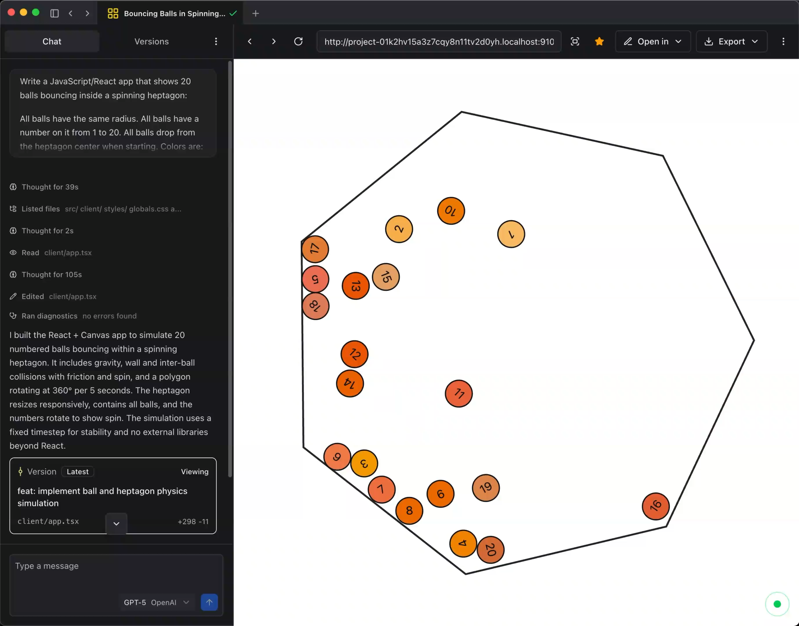

<h1 align="center">Quests</h1>

<p align="center">
  The open-source app builder that builds and runs apps on your computer using any LLM.
</p>

<p align="center">
  <a href="https://quests.dev?ref=github-readme-quests">
    
  </a><a href="https://quests.dev/discord">
    
  </a>
</p>



## Features

- 🔗 Bring your own key (BYOK) - Use the best models from OpenAI, Anthropic, Google, OpenRouter, and more
- 💻 Desktop app - Apps are built and run locally on your machine
- 🌟 Open source - Apache 2.0 licensed, high quality, and tested
- 🤖 Coding agent - State-of-the-art performance with targeted edits and real-time linting
- 🏗️ Multiple projects - Build and run multiple full-stack applications simultaneously
- 📂 Version control - Built-in versioning with restoration
- 📤 Exportable apps - Full-stack React apps that can run anywhere

## [Download Quests](https://quests.dev)

Download the desktop app at [quests.dev](https://quests.dev).

All you need is an AI provider API key - everything runs locally on your computer.

---

## Contributing

> [!IMPORTANT]
> **AI Assistance**
>
> Quests itself can be used for vibe coding, but the project is **not** vibe coded.
>
> If you use any AI assistance while contributing, this must be disclosed in your pull request along with the extent of usage (e.g., "code generation" vs "documentation only").

We welcome high-quality contributions.

- No messy or unfinished code
- Use conventional commit messages (e.g. `feat: add new feature`)
- Run `pnpm check-and-test` to validate your changes

### Monorepo

Quests is organized as a monorepo with the following structure:

- **[@quests/studio](./apps/studio/)** - Electron desktop app for Quests
- **[@quests/workspace](./packages/workspace/)** - Core AI agents, workflow logic, and workspace management
- **[@quests/ai-gateway](./packages/ai-gateway/)** - Local AI gateway for the coding agent and user-built apps
- **[@quests/shim-client](./packages/shim-client/)** - Locally injected control plane for user apps

### Development Setup

You'll need:

- **[Node.js](https://nodejs.org/)** ≥ 22.16.0
- **[pnpm](https://pnpm.io/)**

Then:

```shell
# Clone the repository with submodules
git clone --recursive https://github.com/quests-org/quests.git
cd quests

# Install dependencies
pnpm install

# Start the studio in development mode
pnpm dev:studio
```

## License

Quests is licensed under the Apache 2.0 license. See [LICENSE](./LICENSE) for more information.
